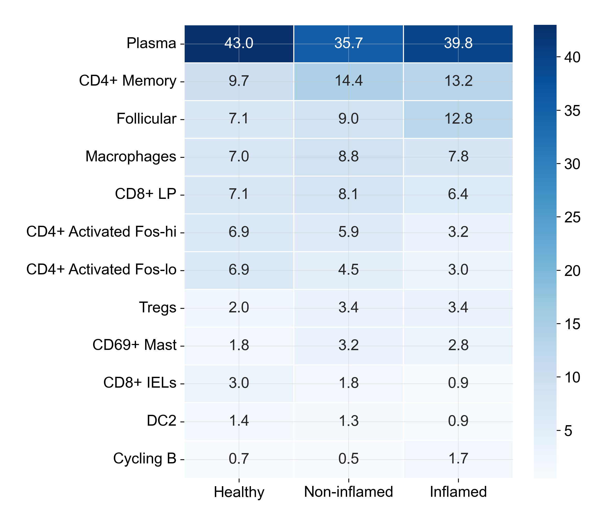
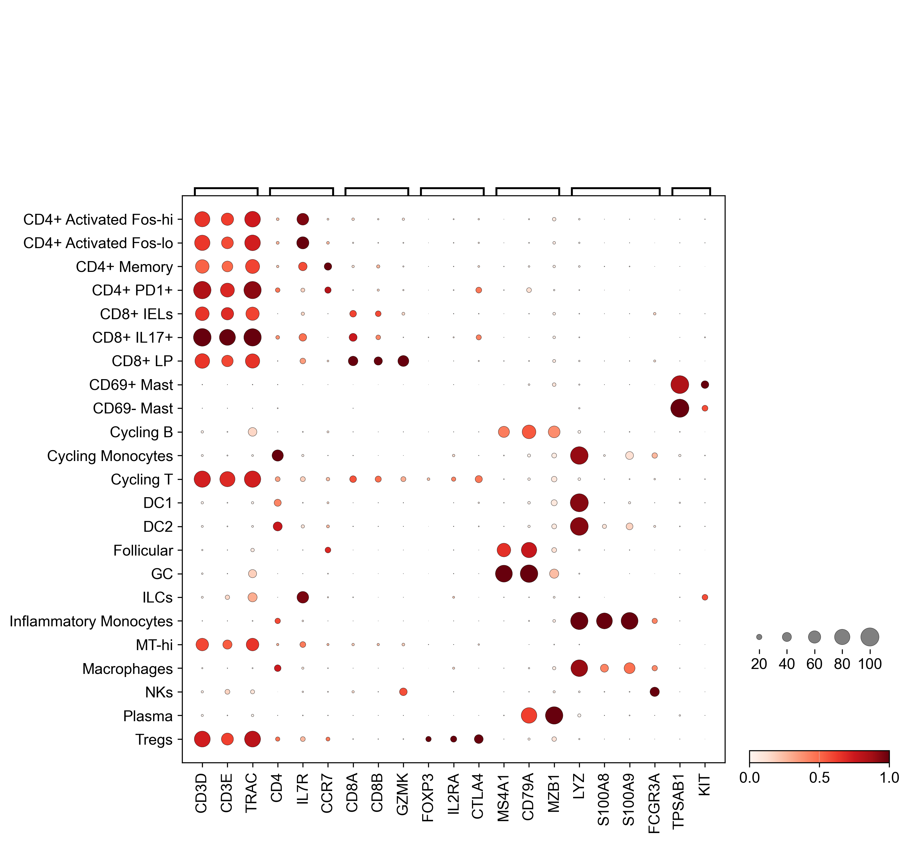
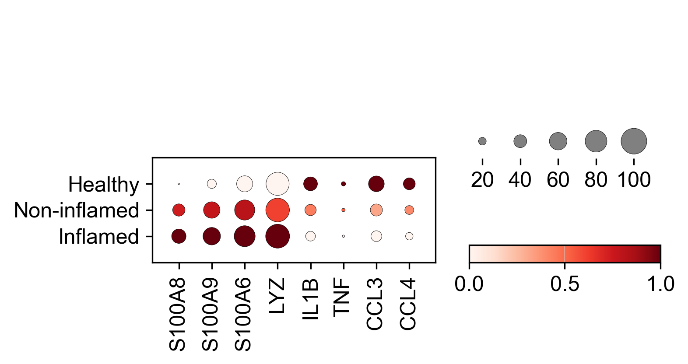

#Single-cell RNA-seq analysis of immune remodeling in inflammatory bowel disease using Python and Scanpy.

## Project Overview

This project analyzes public single-cell RNA-seq data from inflammatory bowel disease intestinal tissue to explore how immune cell populations and transcriptional states differ between healthy, non-inflamed, and inflamed samples.

The current analysis focuses on the immune-cell compartment, with downstream emphasis on macrophage inflammatory programs in ulcerative colitis-associated colon tissue.

## Biological Questions

- Which immune cell populations are present in healthy and IBD-associated intestinal tissue?
- How does immune cell composition differ across healthy, non-inflamed, and inflamed tissue?
- Do annotated immune clusters express expected canonical marker genes?
- Which macrophage genes are associated with inflamed intestinal tissue?
- Which biological pathways are enriched among genes upregulated in inflamed macrophages?

## Analysis Workflow

The project follows a standard single-cell analysis workflow:

```text
Raw immune-cell matrix
        ↓
Metadata alignment
        ↓
AnnData object creation
        ↓
Immune cell composition analysis
        ↓
Marker gene validation
        ↓
Macrophage disease-associated expression analysis
        ↓
Gene Ontology pathway enrichment
```

## Completed Analysis

### 1. Data Exploration

Loaded immune-cell single-cell RNA-seq data, aligned expression data with metadata, and summarized immune cell composition across tissue conditions.

Outputs include:

- Immune cell composition table by condition
- Composition change table comparing healthy and inflamed tissue
- Heatmap of major immune cell populations across healthy, non-inflamed, and inflamed samples

### 2. Marker Gene Analysis

Identified marker genes for annotated immune clusters and validated major immune identities using canonical marker genes.

Key findings:

- T cell clusters express `CD3D`, `CD3E`, and `TRAC`
- Regulatory T cells show markers including `FOXP3`, `IL2RA`, and `CTLA4`
- B/plasma cell populations show `MS4A1`, `CD79A`, `MZB1`, and `JCHAIN`
- Myeloid populations show `LYZ`, `S100A8`, and `S100A9`
- Mast cell clusters show `TPSAB1` and `KIT`

### 3. Disease-Associated Expression Analysis

Compared macrophage gene expression between inflamed and healthy tissue.

Initial findings suggest that inflamed macrophages show stronger expression of inflammatory myeloid genes including:

- `S100A8`
- `S100A9`
- `S100A6`
- `LYZ`

These genes support the presence of disease-associated inflammatory macrophage states in IBD tissue.

### 4. Pathway Enrichment Analysis

Performed Gene Ontology enrichment analysis on genes upregulated in inflamed macrophages compared with healthy macrophages.

Initial enrichment results included broad translation and gene expression terms driven by ribosomal genes. After filtering ribosomal, mitochondrial, and broad non-coding RNA genes, enriched processes were more specific to immune activation.

Key enriched processes included:

- Cellular response to cytokine stimulus
- Positive regulation of cytokine production
- Regulation of tumor necrosis factor production
- Inflammatory response
- Innate immune defense programs

These pathway-level results support the interpretation that inflamed intestinal macrophages show transcriptional programs associated with cytokine responsiveness, inflammatory activation, and innate immune defense.

## Example Figures

### Immune Cell Composition Across Tissue Conditions



### Canonical Immune Marker Validation



### Macrophage Inflammatory Gene Expression



### Macrophage Pathway Enrichment


## Repository Structure

```text
app/                 Streamlit dashboard prototype
data/                Raw and processed data, not tracked in Git
docs/                Project methods documentation
notebooks/           Analysis notebooks
results/figures/     Saved figures
results/tables/      Saved result tables
src/immune_atlas/    Reusable analysis helper code
```

## Notebooks

```text
01_data_exploration.ipynb
```

Loads the immune-cell dataset, attaches metadata, summarizes tissue conditions, and explores immune cell composition.

```text
02_marker_gene_analysis.ipynb
```

Identifies marker genes for immune clusters and validates immune cell annotations using canonical marker genes.

```text
03_disease_associated_expression.ipynb
```

Compares macrophage gene expression between healthy and inflamed tissue to identify disease-associated inflammatory programs.

```text
04_pathway_enrichment_analysis.ipynb
```

Performs Gene Ontology enrichment analysis on macrophage genes upregulated in inflamed tissue and identifies inflammatory immune pathways.

## Results

Key outputs are saved in:

```text
results/figures/
results/tables/
```

Current figure outputs include:

- Immune cell composition heatmap across tissue conditions
- Canonical immune marker dot plot
- Macrophage inflammatory gene dot plot
- Macrophage Gene Ontology enrichment bar plot

Current table outputs include:

- Immune cluster composition by condition
- Immune cluster composition changes
- Cluster marker gene tables
- Macrophage differential expression results
- Macrophage pathway enrichment results
 
## Methods

Detailed analysis methods are described in [docs/methods.md](docs/methods.md).

Briefly, this project uses:

- Scanpy `AnnData` objects for single-cell data representation
- Cell metadata alignment by immune-cell barcode
- Cluster composition comparisons across tissue conditions
- Wilcoxon rank-sum testing for marker gene and differential expression analysis
- Gene Ontology Biological Process enrichment using `gseapy`

## Data Availability

Raw expression matrices and processed AnnData files are not tracked in Git because single-cell RNA-seq files are large.

To reproduce the analysis, download the immune-cell data files into:

```text
data/raw/
```

Required raw files:

```text
Imm.barcodes2.tsv
Imm.genes.tsv
gene_sorted-Imm.matrix.mtx
Imm.tsne.txt
all.meta2.txt
```

Notebook `01_data_exploration.ipynb` loads these raw files, aligns metadata, and creates the processed AnnData object used by downstream notebooks.

The processed AnnData file should be saved locally as:

```text
data/processed/immune_cells_with_metadata.h5ad
```

This file is intentionally excluded from Git tracking.

The streamlit dashboard can be run locally from streamlitapp.py.
Screenshot from streamlit dashboard: 

## Reproducibility

Create and activate a Python environment, then install dependencies:

```bash
pip install -r requirements.txt
```

Run notebooks in order:

```text
01_data_exploration.ipynb
02_marker_gene_analysis.ipynb
03_disease_associated_expression.ipynb
04_pathway_enrichment_analysis.ipynb
```

The notebooks assume that required raw data files are available in `data/raw/`.

## Tools

- Python
- Scanpy
- AnnData
- pandas
- NumPy
- matplotlib
- seaborn
- gseapy
- scikit-learn
- Streamlit

## Limitations

This project is an exploratory single-cell analysis intended for portfolio and learning purposes.

Current limitations:

- Differential expression is performed at the cell level rather than with donor-aware pseudobulk methods.
- Raw and processed single-cell data files are excluded from the repository due to size.
- Current disease-associated expression analysis focuses on macrophages only.
- Pathway enrichment results depend on the selected gene filtering strategy and should be interpreted as hypothesis-generating.

Future versions could improve statistical robustness by using donor-level pseudobulk differential expression and expanding disease-associated analysis to additional immune populations.

## Current Status

Completed:

- Project setup
- Immune-cell data loading and metadata alignment
- Immune composition analysis across tissue conditions
- Marker gene analysis and immune cluster validation
- Macrophage inflamed-versus-healthy expression analysis
- Gene Ontology pathway enrichment analysis
- Reusable helper modules in `src/immune_atlas/`
- Methods documentation

Next steps:

- Extend disease-associated expression analysis to additional immune populations
- Add pathway enrichment for additional cell types
- Implement donor-aware pseudobulk differential expression
- Build a Streamlit dashboard for exploring immune clusters, marker genes, and disease-associated pathways


